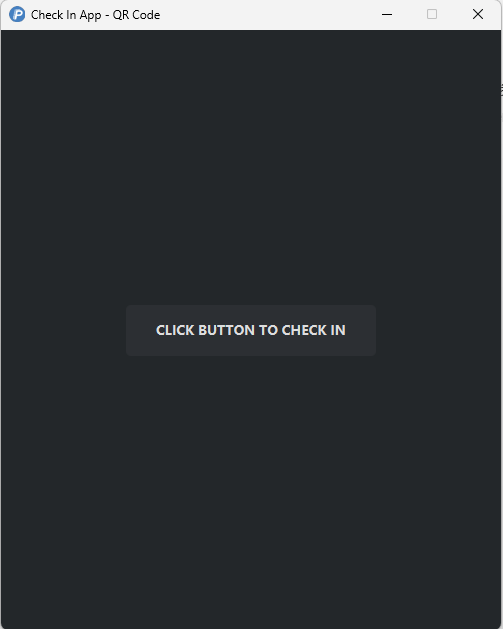
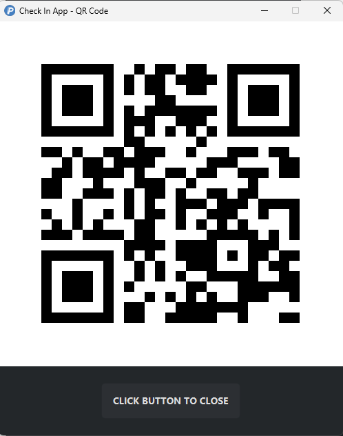
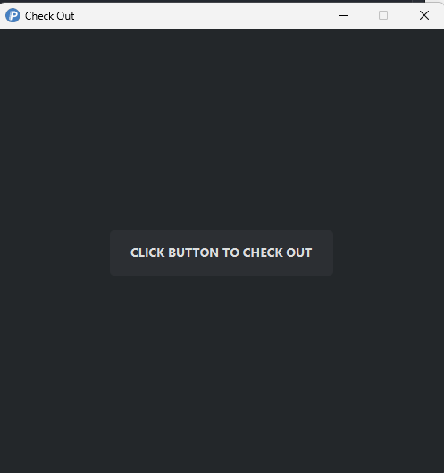
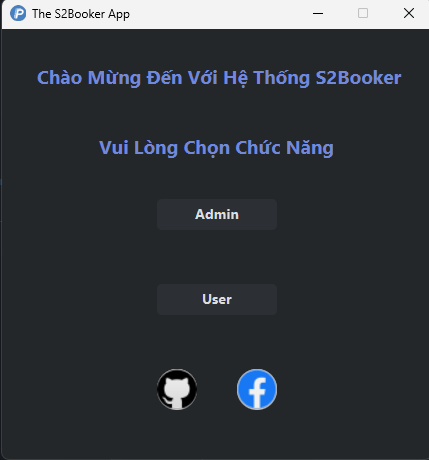
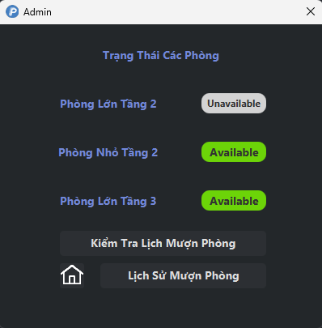
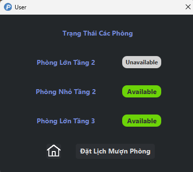
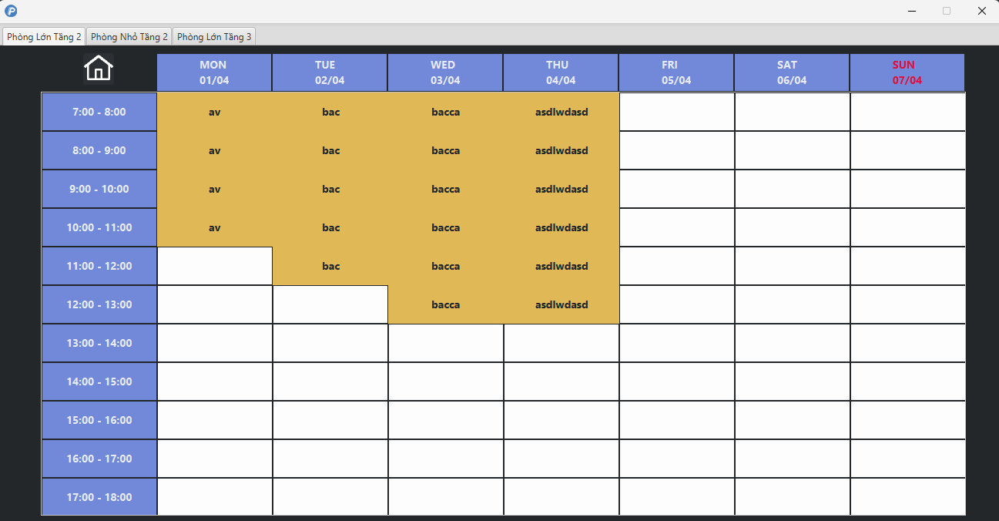
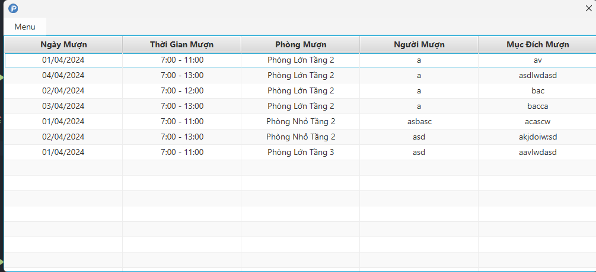
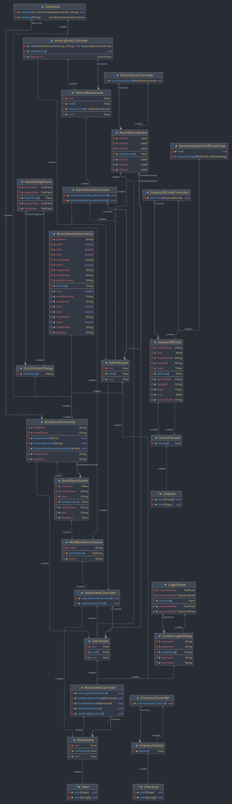

# [S2Booker Desktop App]
- Đây là một ứng dụng giúp mọi người có thể mượn phòng tại trụ sở S2B.
##### Author: [TrDucChinh](https://github.com/TrDucChinh)

## Demo: 
- **Demo:** [Java Course - S2Booker Desktop App](https://www.youtube.com/watch?v=r2YizsEFDj8)

## Các tính năng:
- Có 2 app:
  - 1 app dùng để checkin - checkout tại trụ sở.
  - Khi checkin sẽ gen cho bạn 1 mã QR động.
  - App chính S2Booker:
    - Tham gia với 2 vai trò:
      - **User:** Có thể xem được tổng quan phòng nào hiện tại đang được dùng. Có thể lựa chọn được các phòng để mượn trong các khung giờ.
      - **Admin:** Bao gồm chức năng của User và có thể xem được lịch sử mượn phòng.

## Screenshots

## UML

## Features
- Mượn phòng tại trụ sở S2B.
- Có thể sửa được tên và lý do mượn phòng.
- Over view các phòng.
- Xem lịch sử mượn phòng xuyên suốt.
## Requirements

- JDK 17
- Maven 3.11.0
- Java 17

## Installation
- Cài JDK
- Clone repo này
- Chạy các file "Checkin.jar", "Checkout.jar", "S2Booker_App.jar" để chạy toàn bộ hệ thống.

## License

[MIT](https://choosealicense.com/licenses/mit/)
